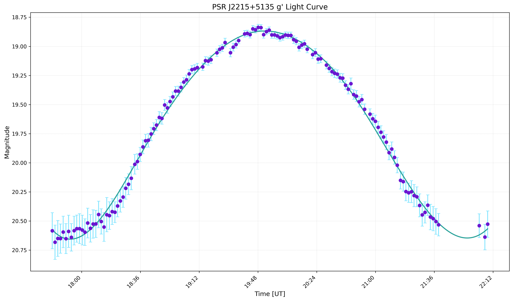
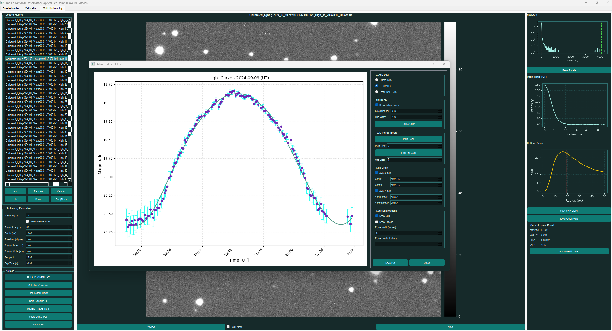
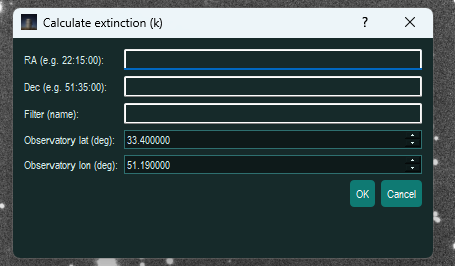
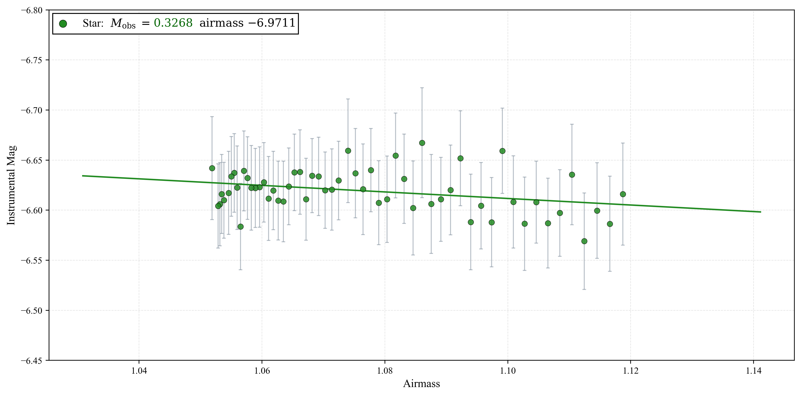
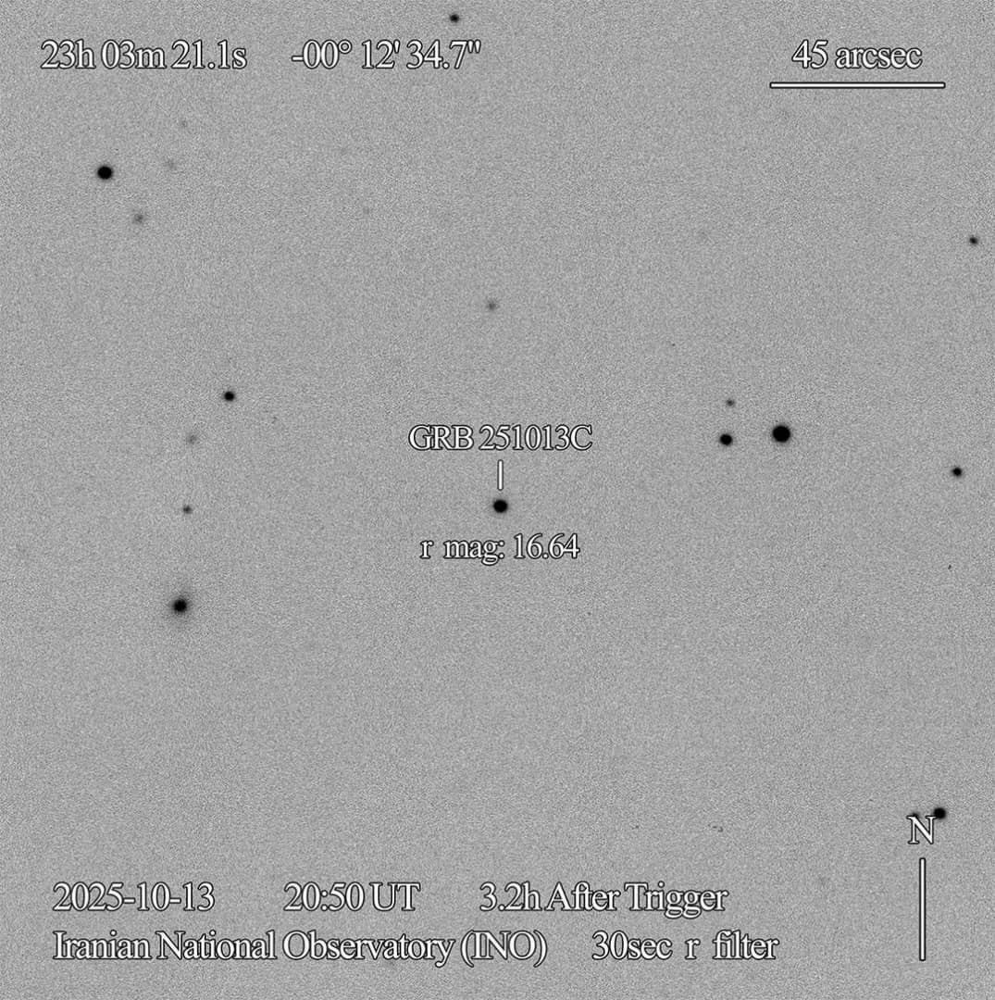
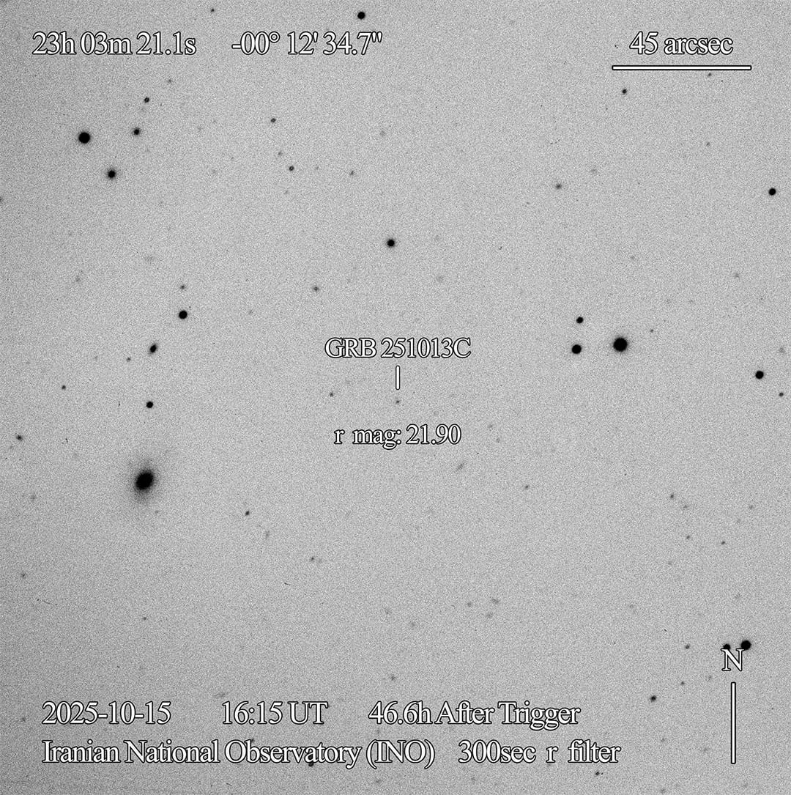

# Scientific Case Studies with INOOR

This directory presents practical applications of the **INOOR** software for real-world astronomical research. The following examples demonstrate the software's capabilities in precision photometry, catalog-based calibration, and atmospheric characterization.

---

## 1. Time-Series Photometry of the Redback Pulsar PSR J2215+5135

**PSR J2215+5135** is a well-known "redback" millisecond pulsar binary system. In such systems, the pulsar's intense radiation heats the inward-facing side of its low-mass companion star. As the binary rotates, we observe significant periodic variations in brightness (light curves) caused by the changing visibility of the heated hemisphere.

### Data Reduction & Methodology
*   **Dataset:** An initial set of 148 frames (each one with 100s of exposure time) was obtained. Following a quality assessment, 10 frames were identified as "bad frames" (due to tracking errors or atmospheric transients or satellite trails) and removed, leaving **138 calibrated frames** for analysis.
*   **Detection Parameters:** PSR J2215+5135 is a relatively faint source. To maintain robust tracking and prevent the centroids from drifting into noise, the **Detection Stamp Size** was optimized to **50 pixels**.
*   **Bulk Photometry:** Automated aperture photometry was performed across the entire time series to extract the instrumental magnitudes.

### Calibration & Zero-Point Determination
To transform instrumental magnitudes into the standard photometric system ($g$-filter), a reference star was selected from the **Pan-STARRS1 (PS1)** catalog:
*   **Reference Star:** [objID 169913338659180415](https://catalogs.mast.stsci.edu/panstarrs)
*   **Method:** The reference star's magnitude was queried via the integrated **Astrometry Tab** after plate-solving the field.
*   **Quality Control:** The software automatically detected outliers in the Zero-Point (ZP) distribution—often caused by momentary source misidentification or passing clouds. These frames were reviewed and corrected manually to ensure a consistent ZP across the night.

### Results
The resulting light curve clearly reveals the orbital modulation of the companion star, providing critical data for modeling the irradiation effects in the binary.

<p align="center">
   
  
</p>

---

## 2. Atmospheric Extinction Characterization

Atmospheric extinction is the reduction in brightness of astronomical objects as their light passes through the Earth's atmosphere. It is defined by the coefficient $k$, which represents the magnitude loss per unit of airmass ($X$).

### The Physics of Extinction
As a source moves across the sky, its altitude changes, and consequently, the amount of atmosphere the light traverses (airmass) varies. The relationship is expressed as:
$$m_{obs} = m_{0} + k \lambda \cdot X$$
Characterizing the site extinction $k$ for different filters is essential for high-precision photometry. While one can calculate a Zero-Point for every individual frame, a more robust scientific approach is to determine the ZP on a clear "standard" frame and apply the extinction correction ($k \cdot X$) to all subsequent observations.

### Workflow in INOOR
1.  **Source Selection:** A constant (non-variable) star is selected within the field.
2.  **Instrumental Mapping:** Bulk photometry is performed to obtain the star's instrumental magnitude throughout the night, which can be verified in the *Advanced Light Curve* window.
3.  **Extinction Calculation:** By clicking the **Calc Extinction** button, the user enters the necessary parameters for airmass calculation.

<p align="center">
  
</p>

### Parameter Configuration
*   **Coordinates & Location:** Accurate RA, Dec, and observatory coordinates are required. INOOR defaults to the **Iranian National Observatory (INO)** site coordinates.
*   **Tagging:** The "Filter" field allows users to tag the output (e.g., "$g$-filter" or "$r$-filter").
*   **Data Persistence:** Results are saved as a `.json` file in the `Output/` directory. Building a long-term dataset of these values allows researchers to estimate $k$ for different seasons or even specific times of night, improving calibration accuracy when standard stars are unavailable.

### Measurement Results
For this observation night, we obtained a primary extinction coefficient in the $g$-filter:
**$k_g \approx 0.33$ mag/airmass**

<p align="center">
  
</p>

*This measurement provides a clear baseline for the photometric conditions at the INO site during the observation run.*

---

## 3. GRB 251013C: Optical Follow-up with INO340

Rapid optical follow-up of transient events like **GRB 251013C** is a critical capability of the **INO340 3.4m telescope**. These observations, reported in [GCN 42492](https://gcn.nasa.gov/circulars/42492), tracked the fading afterglow across multiple nights, highlighting the telescope's contribution to global transient science.

<p align="center">
   
  
</p>

### Citation
```bibtex
@ARTICLE{2025GCN.42492....1I,
       author = {{INO340 Transient Follow-up Team} and {Khosroshahi}, H.~G. and {Shakeri}, S. and {Altafi}, H. and {Karimi Mianrudi}, S. and {Hashemi}, Parisa and {Torkzadeh}, H. and {Rezaei}, Reza and {Wang}, Yu},
        title = "{GRB 251013C : 3.4-m telescope of Iranian National Observatory (INO340) optical observations}",
      journal = {GRB Coordinates Network},
         year = 2025,
        month = oct,
       volume = {42492},
        pages = {1},
       adsurl = {https://ui.adsabs.harvard.edu/abs/2025GCN.42492....1I},
      adsnote = {Provided by the SAO/NASA Astrophysics Data System}
}
```
