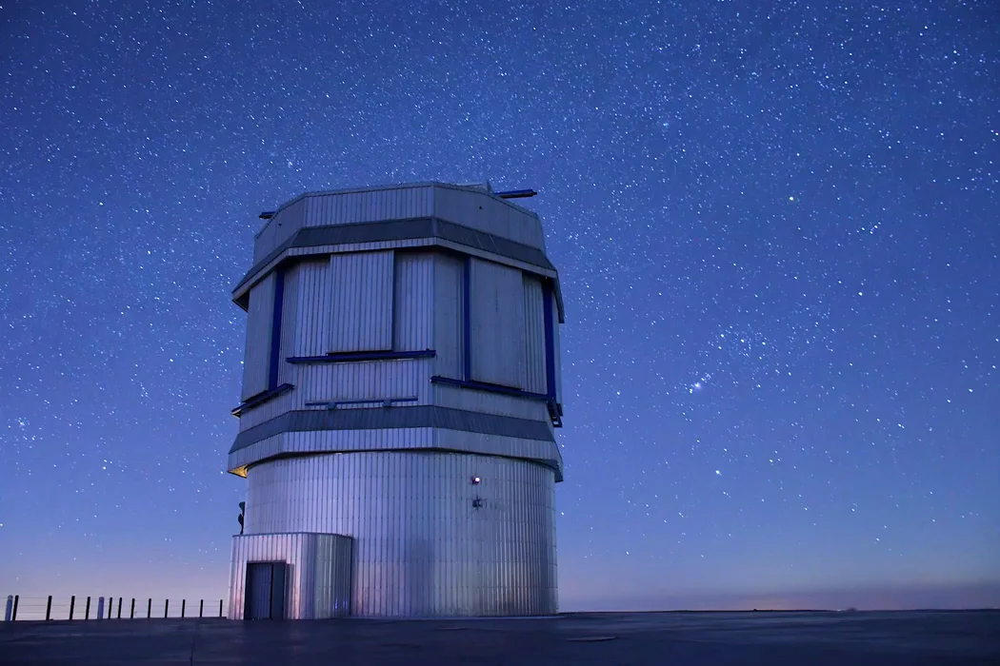

# INOOR: Iranian National Observatory Optical Reduction Software

<p style="text-align:center;">
  
</p>

## Key Features
Also a Help tab is available to guide users through the application.

**INOOR** is a modern, Python application designed for astronomical FITS data reduction, aperture photometry, and astrometry. Built with a clean Model-View-Controller (MVC) architecture and a responsive PyQt5 graphical interface, INOOR provides a robust and user-friendly experience for astronomical research and data processing specifically for INO(Iranian National Observatory).

### 1. Master Frame Creation
Efficiently stack raw calibration frames (Bias, Dark, Flat) to significantly reduce electrical and thermal noise.
- **Combine Methods:** Supports robust Median and Mean stacking algorithms.
- **Sigma Clipping:** Statistical outlier rejection with automatic and manual kernel configurations for effective cosmic ray removal.
- **Interactive Visualization:** Integrated image viewer with ZScale contrast optimization and dynamic histogram adjustments to inspect raw frame quality.

### 2. Automated Calibration Pipeline
A workflow to apply master calibration frames to your science images in batch.
- **Auto Binning & Scaling:** Automatically resamples frames to match dimensions and intelligently scales thermal noise by exposure time if exact darks are unavailable.
- **Hot Pixel Interpolation:** Maps and cleanly interpolates hot pixels utilizing spatial median filters after the calibration steps.

### 3. Multi Photometry
A data analysis module designed for extracting instrumental and apparent magnitudes across time-series datasets.
- **High-Accuracy Detection:** Star localization and aperture tracking across sequential frames.
- **Live Parameter Tuning:** Instant feedback and updates within the UI when adjusting aperture sizes, FWHM, or sky background annuli.
- **Zero-Point & Extinction:** Calculate atmospheric extinction coefficients and cross-reference with known catalog stars to determine true absolute magnitudes.
- **Interactive Light Curves:** Generate, visualize, and export interactive light curves directly within the application.

### 4. Astrometry & Plate Solving
Transform arbitrary image pixel coordinates into standard Right Ascension and Declination (WCS).
- **Automated Plate Solving:** Analyzes star fields in your FITS images to calculate precise center coordinate orientation and rotation angles.
- **Catalog Overlay:** Fetches and natively overlays reference stars from the Pan-STARRS1 catalog onto your visual field.
- **Point-and-Click Querying:** Select any target object in the image array to instantly view its catalog designation, photometric magnitude, and celestial coordinates.

---

## Installation & Usage

INOOR can be run directly from source or installed as a package. We strongly recommend using an isolated virtual environment (such as `conda` or `venv`).

### Prerequisites
- Python 3.10 or higher.
- `git` installed on your system.

### Option 1: Install via Pip (Recommended)
You can directly install the application and all its dependencies globally or within your virtual environment straight from the GitHub repository:

```bash
pip install git+https://github.com/hosseintd/INOOR.git
```

### Option 2: Clone and Run from Source
If you wish to modify the code, contribute to the project, or run the latest unreleased changes:

1. **Clone the repository:**
```bash
git clone https://github.com/hosseintd/INOOR.git
cd INOOR
```

2. **Install dependencies:**
```bash
pip install -r requirements.txt
```

3. **Run the application:**
```bash
python main.py
```

---

## Built With
*   **Python 3.10+**
*   **PyQt5** - For the interactive Graphical User Interface.
*   **Astropy & Photutils** - For core astronomical calculations, WCS transformations, and FITS file handling.
*   **Astroquery** - For accessing astronomical databases like Pan-STARRS.
*   **NumPy & SciPy** - For fast numerical processing and multi-dimensional array manipulation.
*   **Matplotlib** - For generating interactive charts and plotting light curves.

---

## Scientific Examples
For detailed case studies and scientific results obtained using INOOR, including light curves of variable stars and site extinction measurements, please visit the [Examples](./Examples/README.md) directory.

---

## Credits

*   **Developer:** [Hossein Torkzadeh](https://github.com/hosseintd) and IUT Team
*   **IUT Team Members:** Soroush Shakeri, Parisa Hashemi, Saeid Karimi 
*   We thank the INO340 technical and scientific staff supports and specially thanks to Hamed Altafi and Reza Rezaei for their invaluable insights and comments.

<p style="text-align:center; margin-top:8px; font-size:6px; line-height:1; color:#666; font-family:system-ui, Arial, sans-serif;">
  <small>INO Timelaps by Saeid Karimi</small>
</p>

*Developed for the Iranian National Observatory (INO) at the Isfahan University of Technology (IUT).*
